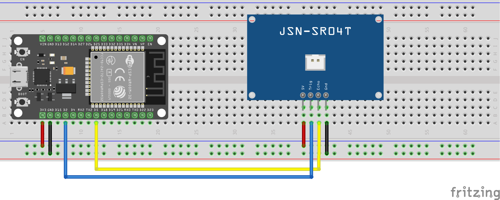
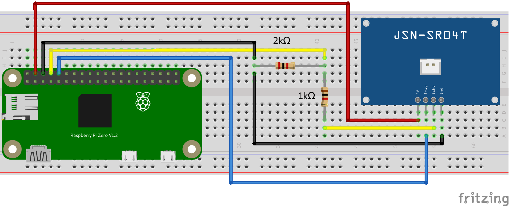

:toc:
:toc-levels: 4
:toc-title: Basic checks for OpenBikeSensor parts

:sectnums:
:toc-placement!:

toc::[]

== ESP32 DEVKIT V1 + AJ-SR04M / JSN-SR04T-v3.0

A basic test to verify the function of the ultrasonic sensors connected to a ESP32 DEVKIT V1 board.

- wire the ESP32 and the ultrasonic sensor board as shown in the schematic

- connect the ultrasonic sensor to the sensor board
- load the source (link:esp32+aj-sr04m.ino[]) into Arduino IDE
- connect the ESP32 with a USB cable to the computer
- upload the sketch to the ESP32
- the measured distance is printed in the serial monitor window of the Arduino IDE

== Raspberry Pi +  AJ-SR04M / JSN-SR04T-v3.0

A basic test to verify the function of the ultrasonic sensors connected to a Raspberry Pi.
All Raspberry Pi models with a https://www.raspberrypi.org/documentation/usage/gpio/[40-pin GPIO header] should work.

For the test it's assumed that you can connect to the Raspberry Pi (local or remote) and a recent Raspbian OS is installed.

- wire the Raspberry Pi and the ultrasonic sensor board as shown in the schematic

- connect the ultrasonic sensor to the sensor board
- execute the Python 3 script link:raspberry_aj_sr04m.py[]
- the measured distance is printed to the console

'''